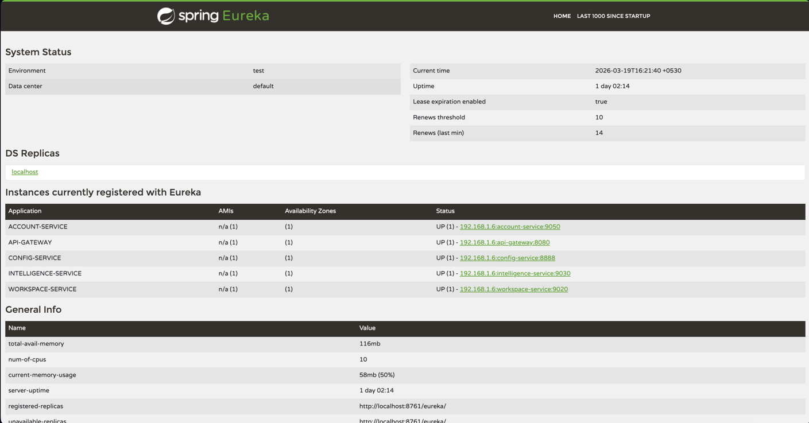
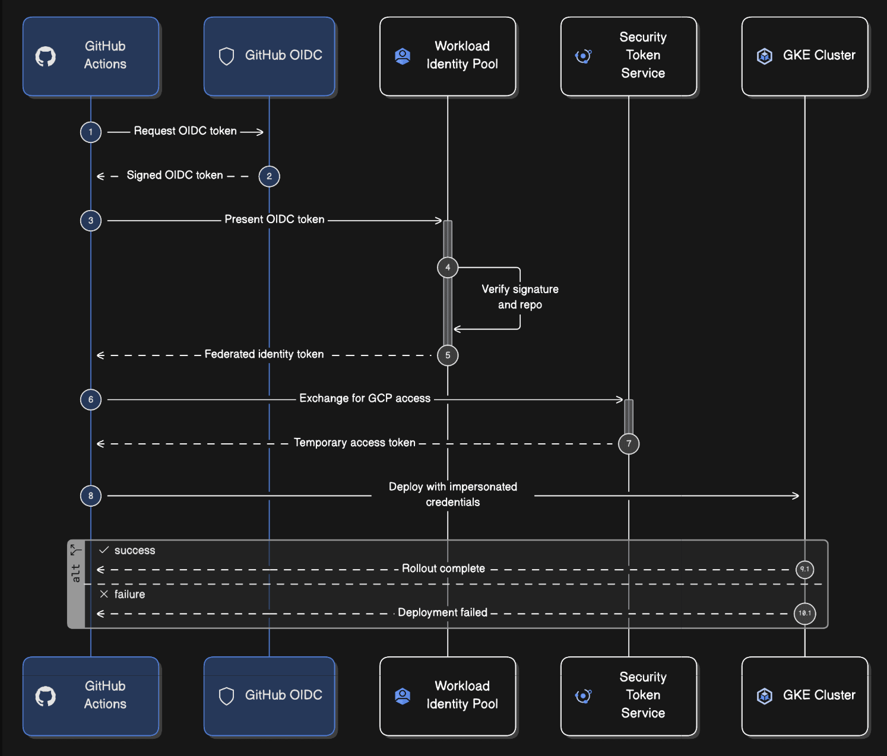

# Front End . AI - Distributed AI-Powered Application Builder

A distributed microservices architecture clone of Lovable.dev - an AI-powered platform for building full-stack applications. This project demonstrates modern cloud-native patterns including service discovery, API gateway routing, Kubernetes deployment, and AI integration.


## Overview

This project is a distributed system built with Spring Boot microservices that enables users to:
- Create and manage projects/workspaces
- Interact with AI for code generation and assistance
- Deploy preview environments
- Handle billing and subscriptions via Stripe

## Architecture

The system follows a microservices architecture with the following components:

```
┌─────────────────────────────────────────────────────────────────┐
│                        API Gateway                               │
│                    (Spring Cloud Gateway)                        │
└────────────────────┬────────────────────────────────────────────┘
                     │
        ┌────────────┼────────────┐
        │            │            │
   ┌────▼────┐  ┌────▼────┐  ┌────▼────┐
   │ Account │  │Workspace│  │   AI    │
   │ Service │  │ Service │  │ Service │
   └────┬────┘  └────┬────┘  └────┬────┘
        │            │            │
        └────────────┴────────────┘
                     │
        ┌────────────┼────────────┐
        │            │            │
   ┌────▼────┐  ┌────▼────┐  ┌────▼────┐
   │  Config │  │Discovery│  │  Kafka  │
   │ Service │  │ Service │  │         │
   └─────────┘  └─────────┘  └─────────┘
```

## Services

| Service | Port | Description | Technologies |
|---------|------|-------------|--------------|
| **API Gateway** | 8080 | Entry point, routing, load balancing | Spring Cloud Gateway |
| **Discovery Service** | 8761 | Service registry (Eureka Server) | Netflix Eureka |
| **Config Service** | 8888 | Centralized configuration management | Spring Cloud Config |
| **Account Service** | 8081 | User authentication, billing, subscriptions | Spring Security, Stripe, PostgreSQL |
| **Workspace Service** | 8082 | Project management, file handling | Spring Data JPA, MinIO |
| **Intelligence Service** | 8083 | AI chat, code generation | Spring AI, OpenAI/Anthropic |

## Technology Stack

### Backend
- **Java 21** - Modern Java with virtual threads
- **Spring Boot 4.0.3** - Application framework
- **Spring Cloud 2025.1.0** - Microservices toolkit
- **Spring Security** - Authentication & authorization
- **Spring AI** - AI/ML integration
- **PostgreSQL** - Primary database
- **Redis** - Caching & session management
- **Kafka** - Event streaming

### Infrastructure
- **Kubernetes** - Container orchestration
- **Docker** - Containerization
- **GKE (Google Kubernetes Engine)** - Managed K8s
- **NGINX Ingress** - Load balancing & SSL
- **JIB** - Docker image building

### External Services
- **Stripe** - Payment processing
- **PostgreSQL with pgvector** - Vector storage for AI
- **MinIO** - Object storage

## Project Structure

```
Lovable/
├── api-gateway/           # Spring Cloud Gateway
├── discovery-service/     # Eureka Server
├── config-service/        # Spring Cloud Config Server
├── account-service/       # User & Billing management
├── workspace-service/     # Project & File management
├── intelligence-service/  # AI Chat & Generation
├── common-lib/           # Shared DTOs, exceptions, enums
├── k8s/
│   ├── infra/            # Namespaces, ingress, policies
│   ├── services/         # Service deployments
│   ├── stateful/         # Databases (PostgreSQL, Redis, Kafka)
│   └── proxy/            # Preview environment proxy
└── README.md
```

## Key Features

### 1. User Management & Authentication
- JWT-based authentication
- User signup/login
- Stripe customer integration

### 2. Project Workspace Management
- Create, update, delete projects
- File management
- Project member roles & permissions
- Preview environment deployment

### 3. AI-Powered Code Generation
- Streaming chat with AI (Server-Sent Events)
- Project-specific chat history
- Code generation and modification

### 4. Billing & Subscriptions
- Stripe integration for payments
- Subscription management
- Usage tracking
- Customer portal

### 5. Kubernetes-Native
- Containerized microservices
- Health checks and probes
- Horizontal scaling ready
- Namespaces for isolation (core vs previews)

## Getting Started

### Prerequisites
- Java 21
- Maven 3.9+
- Docker
- Kubernetes cluster (or minikube/kind)
- kubectl

### Local Development

1. **Start Infrastructure Services**
   ```bash
   # Using Docker Compose for local databases
   docker-compose up -d postgres redis kafka minio
   ```

2. **Run Config Service** (First - required by other services)
   ```bash
   cd config-service
   ./mvnw spring-boot:run
   ```

3. **Run Discovery Service**
   ```bash
   cd discovery-service
   ./mvnw spring-boot:run
   ```

4. **Run Other Services** (in any order)
   ```bash
   cd account-service && ./mvnw spring-boot:run
   cd workspace-service && ./mvnw spring-boot:run
   cd intelligence-service && ./mvnw spring-boot:run
   cd api-gateway && ./mvnw spring-boot:run
   ```

### Kubernetes Deployment

1. **Build Docker Images**
   ```bash
   ./mvnw clean package -DskipTests
   # Images pushed to Docker Hub via JIB plugin
   ```

2. **Create Namespaces & Secrets**
   ```bash
   kubectl apply -f k8s/infra/namespaces.yaml
   kubectl create secret generic app-secrets --from-env-file=.env -n lovable-core
   kubectl create secret generic app-secrets --from-env-file=.env -n lovable-previews
   ```

3. **Deploy Stateful Services**
   ```bash
   kubectl apply -f k8s/stateful/
   ```

4. **Deploy Microservices**
   ```bash
   kubectl apply -f k8s/services/
   ```

5. **Verify Deployment**
   ```bash
   kubectl get pods -n lovable-core
   ```

## API Endpoints

### Account Service (via Gateway)
```
POST /auth/signup          - User registration
POST /auth/login           - User login
GET  /billing/plans        - Get subscription plans
POST /billing/checkout     - Create checkout session
GET  /billing/portal       - Customer portal
```

### Workspace Service (via Gateway)
```
GET    /projects           - List user projects
POST   /projects           - Create new project
GET    /projects/{id}      - Get project details
PATCH  /projects/{id}      - Update project
DELETE /projects/{id}      - Delete project
POST   /projects/{id}/deploy - Deploy preview
```

### Intelligence Service (via Gateway)
```
POST /chat/stream          - Stream AI chat (SSE)
GET  /chat/projects/{id}   - Get chat history
```

## Configuration

External configuration is managed via [Spring Cloud Config](https://github.com/praj031/Distributed-lovable-Config) repository.

Key environment variables:
```properties
# Database
DB_URL=jdbc:postgresql://localhost:5432/lovable
DB_USERNAME=postgres
DB_PASSWORD=secret

# JWT
JWT_SECRET=your-secret-key

# Stripe
STRIPE_SECRET_KEY=sk_test_...
STRIPE_WEBHOOK_SECRET=whsec_...

# AI
OPENAI_API_KEY=sk-...
```

## Screenshots

### Eureka Server Dashboard


### GKE Deployment


## Testing

### Postman Collection
[View Postman Collection](https://pritishraj-official-8728611.postman.co/workspace/Pritish-raj's-Workspace~c12d3ed7-600a-4343-8276-d789eb238c9b/collection/50390415-7c5c7545-b76a-4bd6-8051-705012722945)

## Docker Images

All services are published to Docker Hub:
[https://hub.docker.com/repositories/praj031](https://hub.docker.com/repositories/praj031)

## Architecture Patterns

- **API Gateway Pattern** - Single entry point for all clients
- **Service Discovery** - Eureka for service registration/discovery
- **External Configuration** - Spring Cloud Config for centralized config
- **Circuit Breaker** - Resilience4j (configurable via gateway)
- **Database per Service** - Each service owns its data
- **Event-Driven** - Kafka for async communication
- **CQRS** - Separate read/write models where applicable

## Contributing

1. Fork the repository
2. Create a feature branch (`git checkout -b feature/amazing-feature`)
3. Commit changes (`git commit -m 'Add amazing feature'`)
4. Push to branch (`git push origin feature/amazing-feature`)
5. Open a Pull Request

## License

This project is for educational purposes. Not affiliated with Lovable.dev.

## Acknowledgments

- [Spring Boot](https://spring.io/projects/spring-boot)
- [Spring Cloud](https://spring.io/projects/spring-cloud)
- [Netflix OSS](https://netflix.github.io/)
- [Kubernetes](https://kubernetes.io/)
